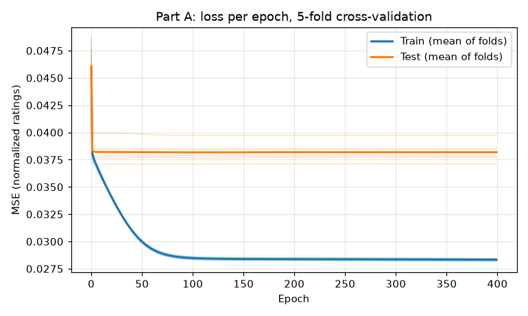

# Computational Intelligence: predicting movie ratings two ways

[](https://github.com/Turnedone/computational-intelligence/actions/workflows/tests.yml)

Two takes on one recommender-system problem, **predicting how a user would rate movies they haven't seen**,
on the [MovieLens 100K](https://grouplens.org/datasets/movielens/100k/) dataset (943 users, 1,682 movies, 100,000 ratings).
Originally university coursework (2020) for the *Computational Intelligence* (Υπολογιστική Νοημοσύνη) course,
cleaned up, fixed and tested in 2026.

| | Approach | Finding |
|---|---|---|
| [**Part A**](part_a) | **Neural network**: one-hot user → ratings for every movie, 5-fold cross-validation | Scores exactly like "predict each movie's average" (RMSE 1.08 stars), because test users are unseen inputs. [Why →](part_a#results) |
| [**Part B**](part_b) | **Genetic algorithm**: evolves a user's missing ratings to agree with their 10 most similar users | Real ratings stay fixed while the rest evolve. The 2026 rewrite fixes bugs that made the 2020 version evolve the wrong ratings. [Details →](part_b#history-bugs-fixed-in-the-2026-cleanup) |

<p align="center">
  
</p>

## Quick start

Requires Python 3.10+.

```bash
git clone https://github.com/Turnedone/computational-intelligence.git
cd computational-intelligence
pip install -r requirements.txt

python -m part_a.preprocess      # Part A: statistics of the data preparation
python -m part_a.train           # Part A: train and cross-validate the network (about a minute)
python -m part_b.genetic --user 2  # Part B: fill in user 2's missing ratings (under a second)
pytest                           # tests
```

## Layout

```
movielens.py   loads the ratings into a users × movies matrix (shared by both parts)
data/u.data    MovieLens 100K ratings
part_a/        preprocess.py, train.py, plots/
part_b/        genetic.py, plots/
tests/         unit tests for both parts
```

The code exactly as submitted in 2020 is at the [`coursework-2020`](https://github.com/Turnedone/computational-intelligence/tree/coursework-2020) tag.
Part B was originally its own repository (`ypologistiki_noimosini_b`) and was merged in here with its history.

## Data

MovieLens 100K: F. Maxwell Harper and Joseph A. Konstan. 2015. *The MovieLens Datasets: History and Context.*
ACM Transactions on Interactive Intelligent Systems 5(4): 19. https://doi.org/10.1145/2827872.
Provided by [GroupLens Research](https://grouplens.org) under its own terms.

## License

The code is [MIT licensed](LICENSE). The MovieLens data is under GroupLens' terms.
