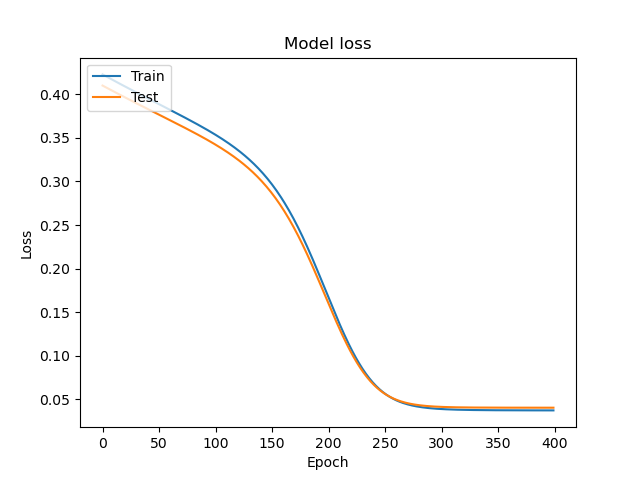

# Computational Intelligence: predicting movie ratings two ways

University coursework (2020) for the *Computational Intelligence* (Υπολογιστική Νοημοσύνη) course.
Both parts tackle the same problem, predicting how a user would rate movies they haven't rated,
on the [MovieLens 100K](https://grouplens.org/datasets/movielens/100k/) dataset (943 users, 1,682 movies, 100,000 ratings).

> **Archived coursework.** This repository is kept as a record and isn't maintained.

| | Approach | |
|---|---|---|
| [**Part A**](part-a) | **Neural network**: per-user rating centering, 5-fold cross-validation, loss curves | [read more →](part-a) |
| [**Part B**](part-b) | **Genetic algorithm**: fills in a user's missing ratings so they agree with the 10 most similar users (Pearson correlation) | [read more →](part-b) |

<p align="center">
  
</p>

## Layout

```
part-a/   dataProcess.py, crossvalidation.py, maketest.py, plots/, u.data (the MovieLens ratings)
part-b/   main.py (the genetic algorithm)
```

Part B was originally its own repository (`ypologistiki_noimosini_b`); it was merged in here with its history.

## Data

MovieLens 100K: F. Maxwell Harper and Joseph A. Konstan. 2015. *The MovieLens Datasets: History and Context.*
ACM Transactions on Interactive Intelligent Systems 5(4): 19. https://doi.org/10.1145/2827872.
Provided by [GroupLens Research](https://grouplens.org) under its own terms.
